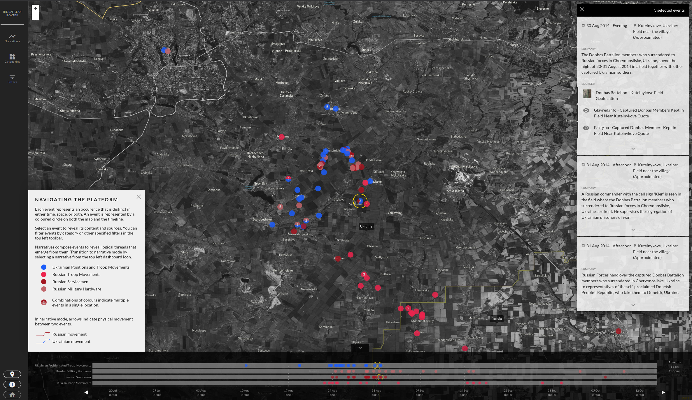

<h1 align="center">
  TimeMap v0
</h1>

<p align="center">
  <strong>TimeMap is a tool for exploration, monitoring and classification of incidents in time and space.<br>See a <a href="https://ilovaisk.forensic-architecture.org">live instance here</a>.</strong><br>
</p>



[](https://travis-ci.com/forensic-architecture/timemap)

## Overview

TimeMap is a standalone frontend application that allows to explore and monitor events in time and space. TimeMap uses [mapbox](https://www.mapbox.com/) satellite imagery as a backdrop by default, and uses Leaflet and d3 to visually map information.

The application is backend agnostic. It does, however, have some requirements regarding the format of data to be ingested. TimeMap works well in tandem with [datasheet-server](https://github.com/breezykermo/datasheet-server), particularly for journalist, activists and general users who are used to working using spreadsheets and just want a shell to visualize events.

TimeMap has the following high-level features capabilites:

* Visualize incidents of particular events on a map.
* Visualize and filter these incidents over time, on an adjustable timeline that allows to zoom in and out.
* Visualize types of incidents by tag and by category, which can be displayed using different styles.

A fully-functioning live version can be found as a result of the Forensic Architecture investigation of the [Ayotzinapa case](https://www.plataforma-ayotzinapa.org).

## Get up and running

### Requirements

To run a TimeMap instance, you'll need:

* Git, node, and npm/yarn.
* A backend that serves data. We recommend using [datasheet-server](https://github.com/breezykermo/datasheet-server), which allows you to turn a Google Spreadsheet into an appropriate server. **To set up timemap with datasheet-server, follow [this tutorial on our website](https://engineering.forensic-architecture.org/timemap-and-datsheet-server)**.
* (Optional) An account at Mapbox. timemap uses Mapbox to power the satellite imagery in the map's backdrop. If you don't specify a Mapbox token, timemap will default to using [OpenStreetMap](https://www.openstreetmap.org).

### Getting started

Note that these commands assume a Bash shell in Mac/Linux:

1. Pull this repository.

```shell
git clone https://github.com/forensic-architecture/timemap
```

2. Install dependencies via yarn (recommended, it's just faster) or npm.

```shell
yarn          # npm install
```

3. Run it via yarn.

```shell
yarn dev      # npm run dev
```

To run with a file that is not 'config.js' in the root directory, set the `CONFIG` environment variable:
```
CONFIG="myotherconfig.js" yarn dev
```

IMPORTANT: Although the application will run _just like that_, in order for TimeMap to be able to display interesting information, you'll have to make sure to have the capacity to serve data, as well as adjusting some configuration parameters. See next section.

### Serving data

In order to see anything interesting on a TimeMap instance, you will need to have a way to serve data to it. The easiest way is to create the appropriate routes through [datesheet-server](), another Forensic Architecture open source project that has been developed as a configurable proxy between a frontend application (such as a TimeMap instance) and a Google Spreadsheet. It is thought for users that do not want or know how to run their own server or backend application.

However, you can also use TimeMap as a frontend for a different type of server, for instance pulling information from a relational database.

#### Data requirements

TimeMap is backend agnostic, but it requires a series of endpoints to provide data for it to visualize. The data is expected in JSON format. Some data elements are required and their format has some required fields. Other additional endpoints are optional, and if enabled, they simply add features to your taste.

The combination of all these data types is called the `domain` of the application in the context of TimeMap.

#### Required endpoints

1. Events: incidents to be mapped in time and space are called `events`. They must include the following fields:

```json
[
  {
    "desc":"SOME DESCRIPTION TEXT",
    "date":"8/23/2011",
    "time":"18:30",
    "location":"LOCATION_NAME",
    "lat":"17.810358",
    "long":"-18.2251664",
    "source":"",
    "tags": "",
    "category": ""
  },
  {}
]

```

Events can have zero, one or multiple tags (comma-separated in one single string), but MUST have one, and only one, category. Category properties are also a required endpoint.

2. Categories: events must be grouped in `categories`. All `events` must contain one (and only one) `category` for them to be displayed in the timeline and map. They are designed to aggregate incidents, for example, according to a population group, or obtained by a type of measure. Categories can be bundled in groups.

```json
[
  {
    "category":"Category 00",
    "category_label":"Category Label",
    "group":"category_group00",
    "group_label":"Events"
  },
  {}
]
```

#### Optional endpoints

## Contribute

### [Code of Conduct](CODE_OF_CONDUCT.md)

Please read before contributing. We endeavour to cultivate a community around timemap and other OSS at Forensic Architecture that is inclusive and respectful. Please join us in this!

### [Contributing Guide](CONTRIBUTING.md)

Learn more about our development process,  i.e. how to propose bugfixes and improvements.

## Community
If you have any questions or just want to chat, please join our team [fa_open_source](https://keybase.io/team/fa_open_source) on Keybase for community discussion. Keybase is a great platform for encrypted chat and file sharing that we use as a public forum.

## [License](LICENSE.md)

timemap is distributed under the [DoNoHarm license](https://github.com/raisely/NoHarm).
